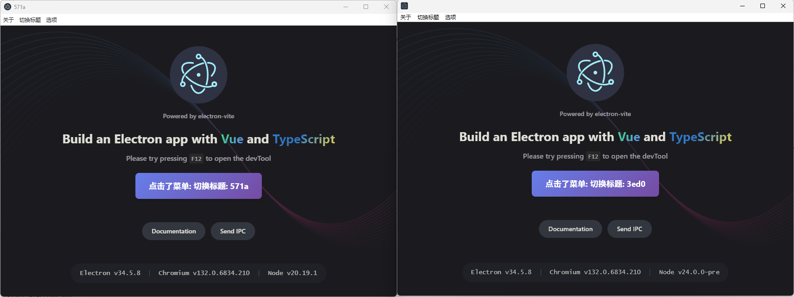

## 说明

用来测试electron-vite和mini-electron的兼容问题.

| 日期       | 变动     | mb版本                 | 结果         | 备注     |
| -------- | ------ | -------------------- | ---------- | ------ |
| 26年5月29日 | 空白项目   | miniblink132\_260528 | 成功, 菜单栏没问题 | 无      |
| 26年5月30日 | 空白项目   | miniblink132\_260528 | 失败 | 标题无法切换      |
| 26年7月4日 | 空白项目   | miniblink132_260622 | 成功 | 问题解决      |
| <br />   | <br /> | <br />               | <br />     | <br /> |


## 复现步骤
* 复制electron.exe到electron-builder.yml配置中的 electronDist: D:\\soft\\electron 目录
* 用pnpm build:win打包, 生成dist/electron-app-1.0.0-win.zip
* 解压运行, 或者双击里面run-with-log.bat运行 (可以把unzip-and-run-main-git.ts放到dist目录下, 用node unzip-and-run-main-git.ts运行, 能自动解压/运行electron项目)
* 点击菜单栏中的切换标题按钮, 期望情况是会随机切换标题 
* 用原版没问题, mb会出现无效的情况



# electron-app

An Electron application with Vue and TypeScript

## Recommended IDE Setup

- [VSCode](https://code.visualstudio.com/) + [ESLint](https://marketplace.visualstudio.com/items?itemName=dbaeumer.vscode-eslint) + [Prettier](https://marketplace.visualstudio.com/items?itemName=esbenp.prettier-vscode) + [Volar](https://marketplace.visualstudio.com/items?itemName=Vue.volar)

## Project Setup

### Install

```bash
$ pnpm install
```

### Development

```bash
$ pnpm dev
```

### Build

```bash
# For windows
$ pnpm build:win

# For macOS
$ pnpm build:mac

# For Linux
$ pnpm build:linux
```


